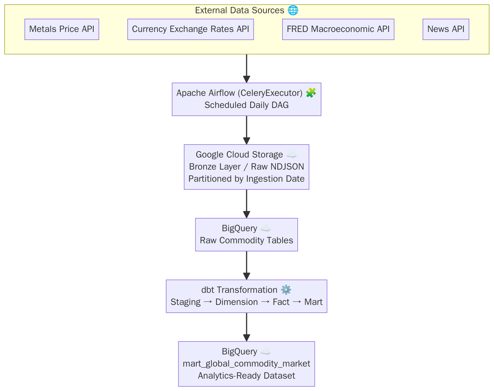
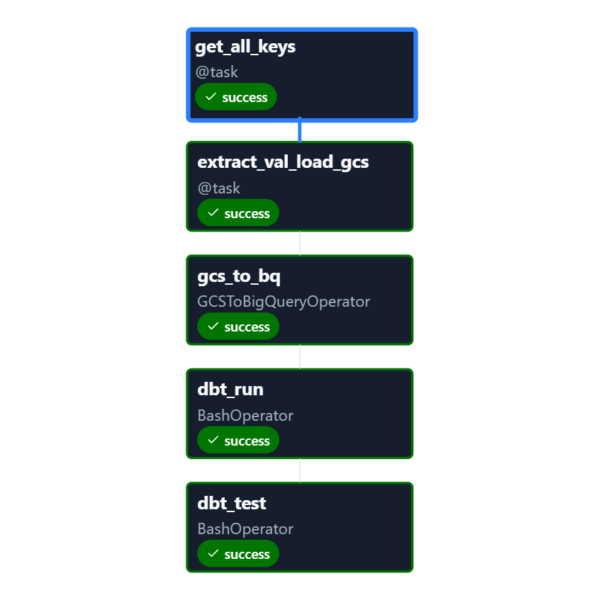
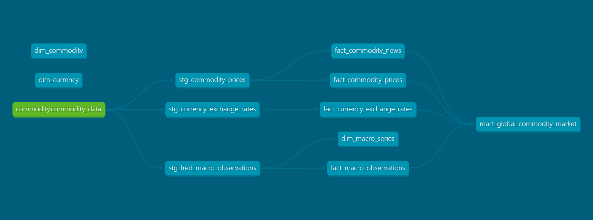
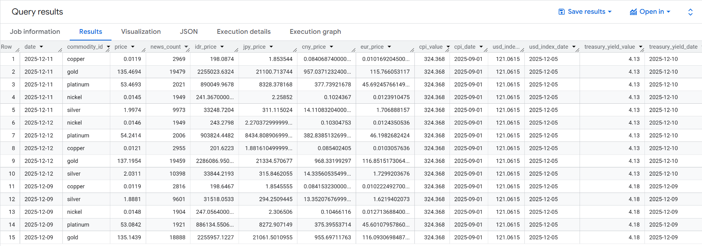

# 🌍 Global Commodity Data Pipeline

**Production-Style Data Engineering Project using Apache Airflow, GCP, BigQuery, and dbt**

---

## Project Summary

This repository contains an **end-to-end data engineering pipeline** that ingests, stores, transforms, and serves **global commodity market data** on a daily basis.

The project is designed to simulate **real-world data engineering workflows**, covering orchestration, cloud integration, data modeling, and data quality enforcement using modern industry tools.

---

## High-Level Architecture

```
External APIs
   ↓
Apache Airflow (Docker, CeleryExecutor)
   ↓
Google Cloud Storage (Bronze / Raw Layer)
   ↓
BigQuery (Raw Tables)
   ↓
dbt (Staging → Dim → Fact → Mart)
   ↓
Analytics-Ready Tables
```

📷 **Architecture Diagram**



---

## Technology Stack

| Layer              | Technology                          |
| ------------------ | ----------------------------------- |
| Orchestration      | Apache Airflow 3.1                  |
| Containerization   | Docker, Docker Compose              |
| Cloud Platform     | Google Cloud Platform (GCP)         |
| Secrets Management | GCP Secret Manager                  |
| Object Storage     | Google Cloud Storage                |
| Data Warehouse     | BigQuery                            |
| Transformation     | dbt (BigQuery adapter)              |
| Language           | Python                              |

---

## Data Sources

| Domain         | Source             | Frequency       | Description                                   |
| -------------- | ------------------ | --------------- | --------------------------------------------- |
| Metals         | Metals.dev API     | Daily           | Gold, Silver, Platinum, Copper, Nickel prices |
| FX Rates       | CurrencyFreaks API | Daily           | USD-based exchange rates                      |
| Macroeconomics | FRED API           | Daily / Monthly | CPI, USD Index, 10Y Treasury Yield            |
| News           | NewsAPI            | Daily           | Commodity-related news volume                 |

---

## Data Lake Design (GCS)

Raw data is stored in **newline-delimited JSON (NDJSON)** format to ensure schema flexibility and historical traceability.

```
gs://data-lake-bronze-project-global-commodityy/
└── global_commodity/
    └── date=YYYY-MM-DD/
        └── commodity_data.json
```

📷 **Sample Raw Data (NDJSON)**
```json
{
  "timestamp": "2025-12-12 01:39:12",
  "metals": {
    "timestamp": "2025-12-12T01:38:03.570Z",
    "metals": {
      "gold": 137.1954,
      "silver": 2.0311,
      "platinum": 54.2414
    },
    "currency_base": "USD"
  },
  "currency": {
    "base": "USD",
    "rates": {
      "IDR": "16663.0",
      "JPY": "155.505",
      "EUR": "0.851716"
    }
  },
  "macro": {
    "CPIAUCSL": {
      "observations": [
        { "date": "2025-09-01", "value": "324.368" }
      ]
    }
  },
  "news": {
    "gold": 19459,
    "silver": 10398
  }
}
```
---

## Airflow Orchestration

**DAG ID:** `global_commodity`
**Schedule:** `@daily`
**Catchup:** Enabled (supports historical backfill)

DAG Task Flow

```
get_all_keys
   ↓
extract_val_load_gcs
   ↓
gcs_to_bq
   ↓
dbt_run
   ↓
dbt_test
```

**Key characteristics:**

* Hybrid **TaskFlow API + Operators**
* Secrets fetched dynamically from GCP Secret Manager
* Schema evolution supported (`ALLOW_FIELD_ADDITION`)
* Raw data persisted before transformation (replayable)

📷 **Airflow DAG Graph View**


---

## Secrets & Configuration

* API keys stored securely in **GCP Secret Manager**
* Retrieved at runtime using `google.cloud.secretmanager`
* Development authentication via **Application Default Credentials (ADC)**

Configuration managed through:

* `.env`
* Docker Compose environment variables

---

## Data Transformation with dbt

The warehouse follows a **layered modeling approach** to ensure clarity, scalability, and maintainability.

dbt Model Layers

| Layer     | Purpose                                                |
| --------- | ------------------------------------------------------ |
| Staging   | Flattening, casting, and schema normalization          |
| Dimension | Reference entities (commodity, currency, macro series) |
| Fact      | Time-series measurements                               |
| Mart      | Analytics-ready denormalized dataset                   |

📷 **dbt Lineage Graph**


---

## Core Data Models

Dimensions

* `dim_commodity`
* `dim_currency`
* `dim_macro_series`

Facts

* `fact_commodity_prices`
* `fact_commodity_news`
* `fact_currency_exchange_rates`
* `fact_macro_observations`

Mart

* `mart_global_commodity_market`

📊 **Mart Table Schema (Example)**

| Column Name | Type | Description |
|------------|------|-------------|
| date | DATE | Observation date |
| commodity_id | STRING | Commodity identifier (gold, silver, etc.) |
| price | FLOAT | Commodity price in USD |
| news_count | INTEGER | Number of related news articles |
| idr_price | FLOAT | Price converted to IDR |
| jpy_price | FLOAT | Price converted to JPY |
| cny_price | FLOAT | Price converted to CNY |
| eur_price | FLOAT | Price converted to EUR |
| cpi_value | NUMERIC | Consumer Price Index value |
| cpi_date | DATE | CPI observation date |
| usd_index_value | NUMERIC | USD index value |
| treasury_yield_value | NUMERIC | 10Y Treasury yield |

---

## Data Quality & Reliability

* **dbt tests** executed after every pipeline run
* Incremental models with:

  * `unique_key`
  * Date-based partitioning
  * Clustered dimensions
* Late-arriving macro data handled via **last observation carried forward (LOCF)**
* Explicit logging at each extraction step
* Pipeline fails fast on upstream API errors (no silent data corruption)

---

## Running the Project Locally

```bash
docker compose up -d
```

Access

* Airflow UI: `http://localhost:8080`
* Default credentials:

  * Username: `airflow`
  * Password: `airflow`

Trigger the DAG manually or wait for scheduled execution.

---

## Output Dataset

Final analytics-ready table:

```
project-global-commodityy.dwh_commodity.mart_global_commodity_market
```

Contains:

* Daily commodity prices
* Currency-converted prices (IDR, JPY, CNY, EUR)
* News volume indicators
* CPI, USD Index, and Treasury Yield signals

📷 **Sample Query Result**


---

## Key Engineering Highlights

* Production-style Airflow setup with CeleryExecutor
* Cloud-native secret management
* Idempotent, replayable ingestion
* Incremental warehouse modeling with dbt
* Clear separation of raw, curated, and analytics layers

---

## Future Improvements

* Re-enable Google Trends ingestion with rate-limit handling
* SLA monitoring and alerting
* BI dashboard integration (Looker or Tableau or Power BI)
* Deployment
---
