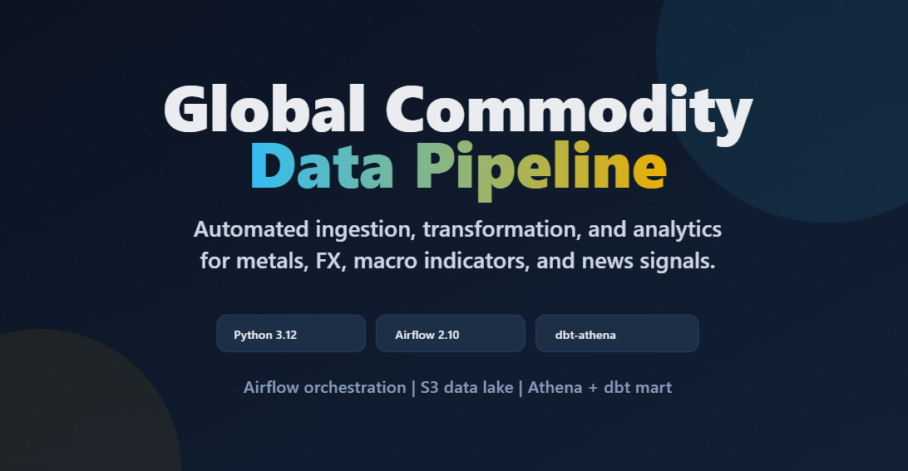
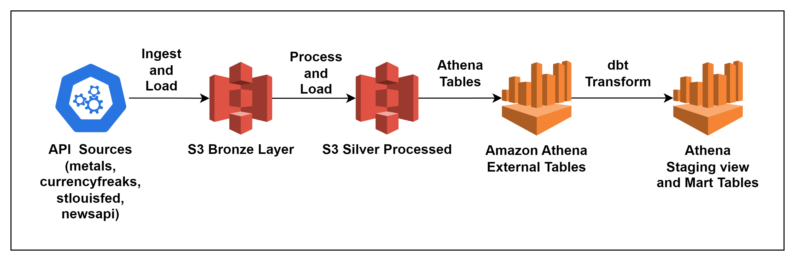
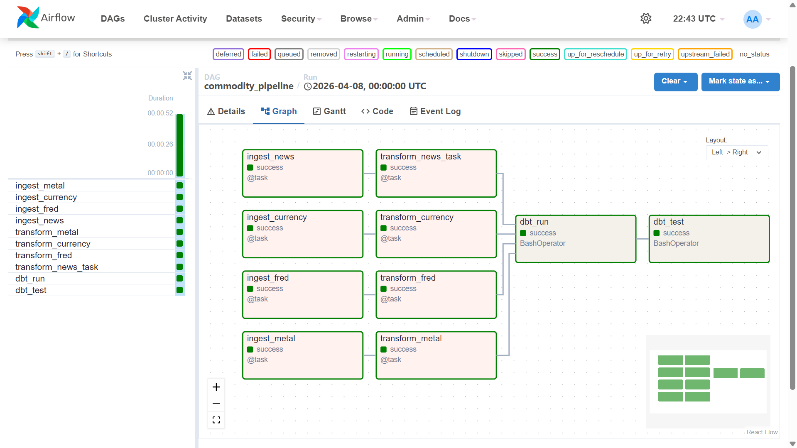
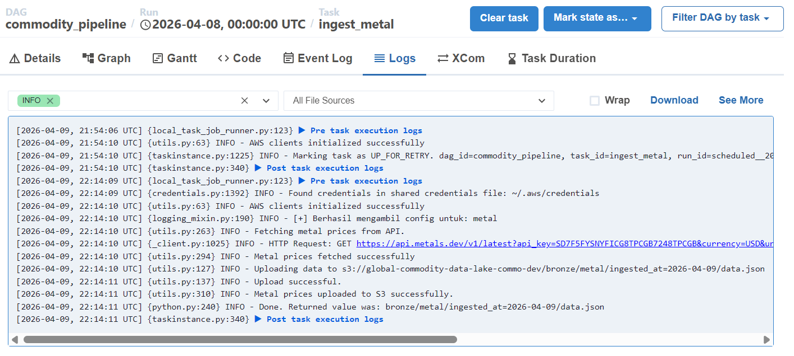
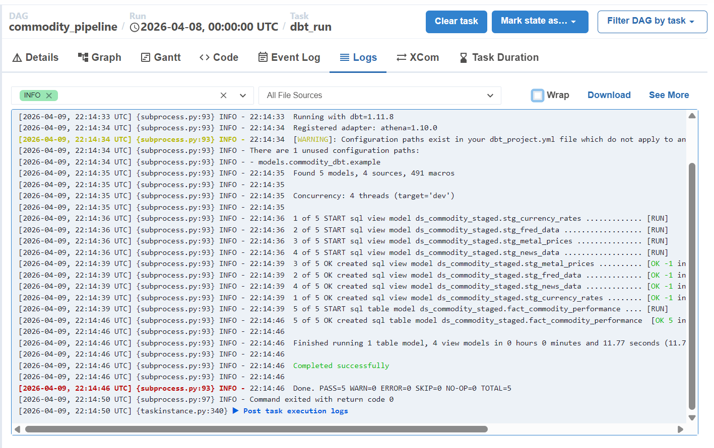
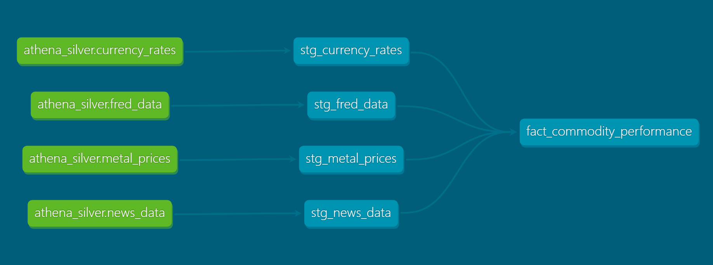
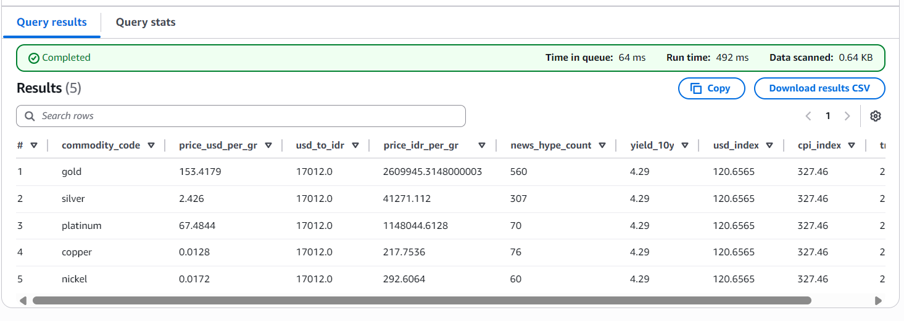
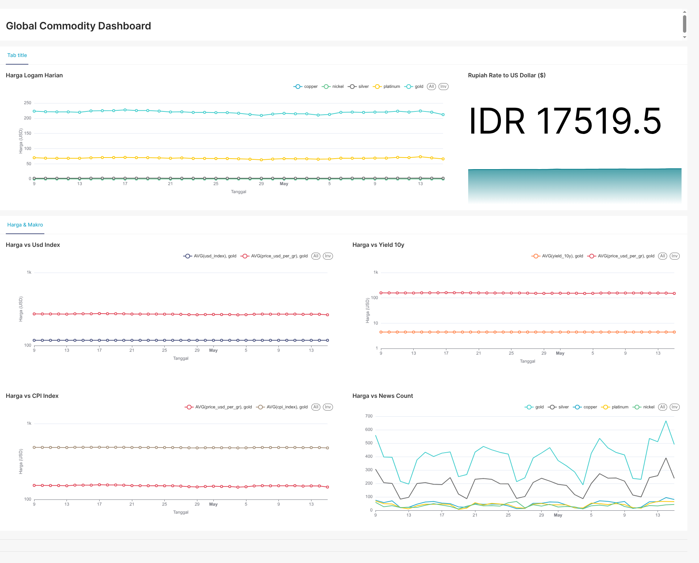

# Global Commodity Data Pipeline



    

End-to-end data pipeline for commodity intelligence. Ingests metals prices, FX rates, macro indicators, and news; transforms with dbt; serves analytics via Athena and **visualized with Apache Superset**.

### What It Does

- Ingests 4 live data sources: metals, currency rates, FRED, news
- Orchestrates with Apache Airflow (daily DAG)
- Stores Bronze (raw) → Silver (parquet) on S3
- Models with dbt (staging + marts)
- Exposes via Athena external tables
- **Visualizes** via interactive Apache Superset dashboard

## Architecture



### Pipeline & Dashboard Screenshots and Overview

<details>
<summary><strong>📊 Airflow Orchestration</strong></summary>




</details>

<br>

<details>
<summary><strong>🔄 dbt Transformation</strong></summary>



</details>
<br>
<details>
<summary><strong>🗂️ Superset Dashboard Export</strong></summary>


A portable export of the dashboard is available at:
[`dashboards/dashboard_export_20260516T050021.zip`](dashboards/dashboard_export_20260516T050021.zip)

To import into another Superset instance:
1. Go to **Dashboards → Import Dashboard**
2. Upload the `.zip` file
3. Map the database connection to your Athena instance


The pipeline feeds into **Apache Superset** for interactive dashboards:

| Chart | Description |
|-------|-------------|
| **Harga Logam Harian** | Line chart of metal prices (USD/gr) over time, grouped by commodity code |
| **Harga vs USD Index** | Dual-axis chart comparing commodity price with DXY dollar strength index |
| **Harga vs Yield 10Y** | Dual-axis chart comparing commodity price with US 10-year treasury yield |
| **Harga vs CPI** | Dual-axis chart comparing commodity price with consumer price index |
| **Harga vs News Hype** | Correlation between news mention volume and commodity price movements |
| **IDR Rate to USD** | Big number with trendline showing the latest USD/IDR exchange rate |

> **Access:** `http://localhost:8088` — Username: `admin`, Password: `admin`
</details>

## Tech & Stack

| Layer | Tools |
|-------|-------|
| **Orchestration** | Apache Airflow 2.10.2 |
| **Compute** | Python 3.12, dbt-athena-community |

| Layer | Tools |
|-------|-------|
| **Orchestration** | Apache Airflow 2.10.2 |
| **Compute** | Python 3.12, dbt-athena-community |
| **Storage** | AWS S3, Glue Data Catalog, Athena |
| **Config** | AWS SSM Parameter Store |
| **Testing** | Pytest, Docker Compose |

## Project Structure

```
.
├── dags/                   # Airflow DAG, ingestion, transforms, Pydantic models
├── commodity_dbt/          # dbt: staging models, marts, tests
├── terraform-aws/          # Infrastructure: S3, SSM, Glue catalog
├── tests/                  # Unit tests (60+ tests)
├── ATHENA_SCHEMA.sql       # Athena external table DDL
└── docker-compose.yaml     # Local dev environment
```

## Quick Start

### Prerequisites

- Docker + Docker Compose
- AWS credentials in `~/.aws`
- SSM parameters at `/global-commodity/datasource/{metal|currency|fred|news_api}/{url|api_key}`

### Setup (5 min)

1. Clone & create `.env`:

```bash
cat > .env << EOF
POSTGRES_USER=airflow
POSTGRES_PASSWORD=airflow
POSTGRES_DB=airflow
AIRFLOW_UID=50000
EOF
```

2. Start services:

```bash
docker compose up airflow-init
docker compose up -d
```

3. Open Airflow:

```
http://localhost:8080
Username: admin
Password: admin
```

4. Trigger DAG:

- Enable `commodity_pipeline` in Airflow UI
- Click **Trigger DAG**
- Monitor: ingest → transform → dbt run → dbt test

## Data Architecture

### Layers

| Layer | Format | Location |
|-------|--------|----------|
| **Bronze** | JSON/NDJSON (raw) | `s3://.../bronze/{metal,currency,fred,news}/` |
| **Silver** | Parquet (cleaned) | `s3://.../silver/{metal,currency,fred,news}/` |
| **Analytics** | Catalog tables | `ds_commodity_staged.*` (Athena) |

### Mart: `fact_commodity_performance`

Output schema:
- `commodity_code`, `price_usd_per_gr`, `price_idr_per_gr`
- `usd_to_idr`, `news_hype_count`
- `yield_10y`, `usd_index`, `cpi_index`
- `trade_date`

### dbt Models

**Sources:** metal_prices, currency_rates, fred_data, news_data (from Athena Silver)

**Staging:** normalize types, dates, currencies

**Marts:** one fact table for commodity analytics

## Testing

### Run Tests

```bash
# All tests (60+ tests across models, utils, DAGs)
pytest tests -v

# Or with coverage
pytest tests --cov=dags --cov-report=html

# Helper script
./run_tests.sh all
./run_tests.sh coverage
```

### Test Coverage

- **test_models.py:** Pydantic validations, edge cases
- **test_utils.py:** S3 ops, API fetches, transforms (mocked)
- **test_dags.py:** DAG structure, dependencies, task config